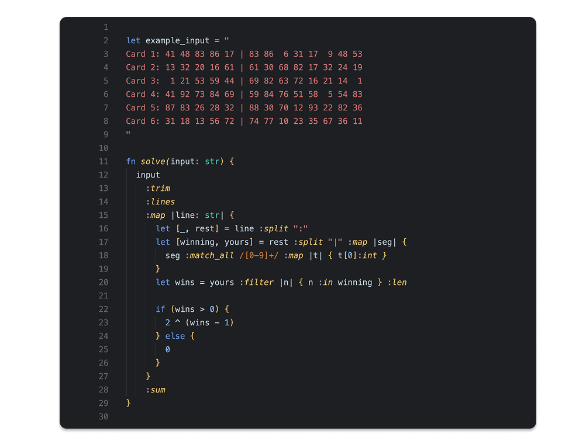

# Adventlang

Your friendly language that makes solving Advent of Code challenges a breeze!

_Note: This is a WORK IN PROGRESS. For the previous, working version of this language, see: https://github.com/kelleyvanevert/adventofcode2023?tab=readme-ov-file#adventlang_


I must say, it's a bit insulting that GitHub thinks Adventlang most resembles Perl 🤔


## Concept

The concept came about while I was learning Rust for the first time while doing Advent of Code 2022. I loved Rust's syntax so much, even separately from the _other cool thing_ about Rust (its innovative typing system that allows it to eliminate garbage collection while staying low-level), that I wanted to create a language with that kind of syntax, but even easier to use. For example for solving Advent of Code challenges. What especially stood out, is that I'd often be writing code like this:

```rust
let total = input.trim().lines().map(|line| {
    line.split("-").map(|s| s.parse::<usize>().unwrap()).sum::<usize>()
}).sum::<usize>()
```

I figured, I'd create a language, that combines the syntax of Rust, but adding a new special syntax element for applying data transformations in a postfix/infix style easily:

```al
let total = input :trim :lines :map |line| { line :split "-" :map int :sum } :sum
```

The idea is that you can take any function

```al
fn map<A, B>(arr: [A], f: fn(A) -> B): [B] {
  // ...
}
```

and apply it as a postfix or infix operator, like `a :map f`.

So, the next year, 2023, I did Advent of Code while creating an interpreted language "on the go". Every next day, I'd add whatever features the language needed, in order to solve the challenge of that particular day. I was able to get to ± day 17 in this way, until performance became a problem and I switched back to solving the challenges (only) in Rust.

My plans were to create a compile language for the next year. But because that's just so much harder, you really need to prepare in advance and can't "wing it" like I did with the interpreted version of 2023, I didn't get around to it.

But, 2025 might be the year! In April and May I spent some time investigating and creating some minimal proof-of-concepts with LLVM, as well as thinking a lot about the type system. One crucial big missing feature is a type checker, which I started working on in October. (I was also convined by Blaž to use Zed, which meant I needed to first create a new Tree-sitter parser as well, so as to allow Zed syntax highlighting.) With some effort and luck, I might be able to participate in Advent of Code 2025 with a compiled version of Adventlang! 🤘

Status:

- [x] 100% create a new parser using Tree-sitter (it's 150x as fast!)
- [ ] 60% create a type checker
  - [x] basic unification setup
  - [x] loops, labels, breaking, typing blocks
  - [x] function definitions and calls
  - [ ] named and optional arguments for functions
  - [x] pretty error messages and good testing infrastructure
  - [x] generics (parametric polymorphism)
  - [x] operator overloading (ad-hoc polymorphism)
  - [ ] named fn overloading (ad-hoc polymorphism)
  - [ ] coalescing, nullability
  - [ ] automatic conversions (?) / allowing non-bools in conditions
- [ ] 0% create a compiler using LLVM

## Example (Advent of Code 2023, day 4)



## Things learned while creating the type checker / inferencer

I'm a bit ashamed how much effort this took, given that I literally did my masters' on these topics 😅 But here's some concrete things I learned:

- "Hindley-Milner type checking" is just the typical unification thing, and it's quite easy. Fix the constraints at the end, or during the tree walking, whatever. **"You can't miss te MGU."** You also don't need bidirectional type checking for this.

- **Overloading doesn't work well with Hindley-Milner type checking.** So, as I understand it for now, at least, is that you need to resort to hacks. The hack I used was to create a new type of constraint `ChooseOverload`, which can either succeed at selecting the only possible overload, or fail to have enough information as of yet, in which case I just bump it back to the end of the list of constraints. If at some point we don't make any progress any more and it can also not be solved, then the inferencer just quits. (Also, in order to work out `ChooseOverload`, you need to hypothesize and try around for a bit, so snapshot-and-rollback functionality is needed for your unification table.)

- **Bidirectional type checking is essential for elided generics (parametric polymorphism).** Bidirectional type checking is specifically very useful for type checking operations that are otherwise very hard to generalize, for example elided generics (parametric polymorphism) in lambda expressions. Because checking a lambda against a generic signature is easy, whereas inferring a non- or possibly-generic type from it and then having to deal with it ... I wouldn't know how to start solving that. Crucial, is to have enough type information about the parameters of a function, so that when you give it, say, an anonymous function as an argument, it can be checked correctly.

  It also makes me understand better why e.g. Rust requires full type annotations for function params and return types (the "function boundaries"), I bet it makes a lot of difference when applying bidirectinal typing, where otherwise things can get quite out of hand (and you'd need a crazy TypeScript-level heuristical and maybe not very deterministic/predictable type checker).

- Google Gemini is actually quite good at prividing help 😅 In research mode, the stuff it says is quite useful and well thought through.

## Issues encountered while creating the Tree-sitter parser

### `postfix_call_expr` precedence issue

When creating the `postfix_call_expr`, I had a lot of trouble getting the precedence right. I don't know exactly why or how, but the solution that I now have works, and uses a strategically placed `$._ws_preceding_arg`, to force the `optional(right_side)` to be greedy.

### `scanner.c` very confusing handling of `ERROR_SENTINEL` and `STRING_CONTENT`

I don't really know what's going on here, but, adding `STRING_CONTENT` to the external lexer, to avoid the issue of Tree-sitter skipping whitespaces as extras withing a string literal, causes problems. In the Rust tree sitter grammar, I see that they also added `ERROR_SENTINEL`, in order to specifically avoid it during recovery (of which I don't really understand how it works). Adding either of these two, or both, creates problems for the `postfix_call_expr` precedence issue. So .. I just recover skipped whitespaces in the string manually, while converting the CST to the AST in Rust.

### Newlines as stmt separators

This was a whole hassle. It now works kinda OK, but not amazing. There's some edge-cases, like parsing multiple lines of regexes, like so:

```al
/abc/
/def/
```

..because I can't differentiate it from a binary expression `a / b`.
